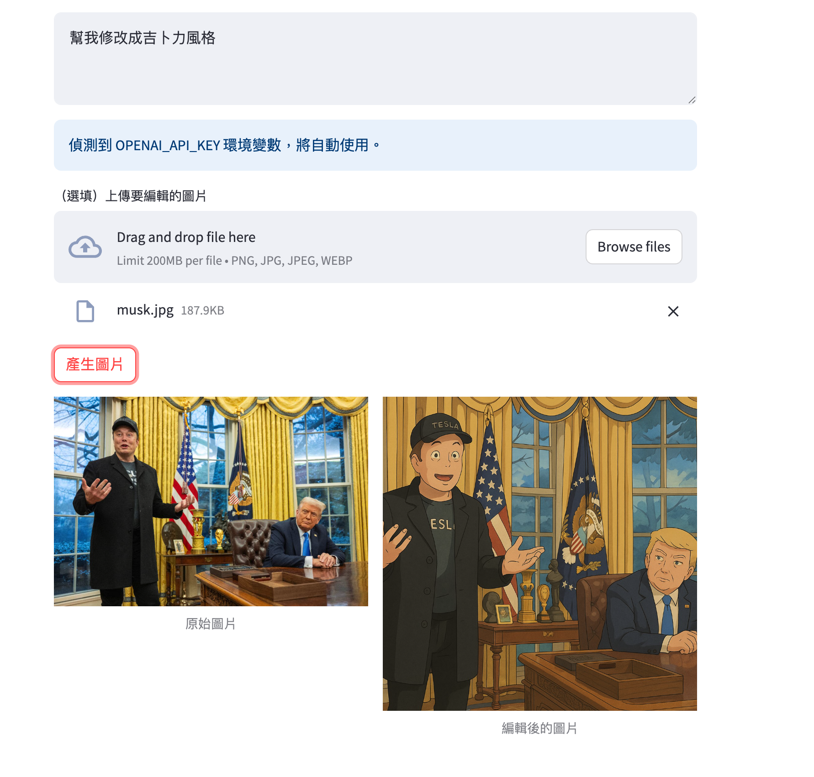

# OpenAI GPT-Image-1 文字生成圖片 Demo

這是一個使用 [Streamlit](https://streamlit.io/) 製作的網頁應用，讓你可以：

- 輸入描述文字，透過 [OpenAI gpt-image-1 API](https://platform.openai.com/docs/api-reference/images) 產生圖片
- 上傳一張圖片，並根據描述進行圖片編輯，原圖與編輯後圖片會並排顯示，方便對比

## 範例畫面



## 使用方式

1. 安裝必要套件：

   ```bash
   pip install -r requirements.txt
   ```

2. 啟動應用：

   ```bash
   streamlit run app.py
   ```

3. 操作說明：
   - 若有設定 `OPENAI_API_KEY` 環境變數，系統會自動使用，不會顯示 API Key 輸入欄位
   - 輸入圖片描述（prompt）
   - （選填）上傳要編輯的圖片，若有上傳則會進行圖片編輯，否則直接生成新圖片
   - 點擊「產生圖片」即可

4. 產生結果：
   - 若有上傳圖片，會顯示「原始圖片」與「編輯後的圖片」並排對比
   - 若未上傳圖片，僅顯示生成的新圖片

## 主要檔案說明

- `app.py`：主程式，Streamlit 前端與 OpenAI API 串接邏輯
- `requirements.txt`：所需 Python 套件列表
- `img/gpt-img-1.png`：範例圖片

## 注意事項

- 需自備 OpenAI API Key
- 產生的圖片僅供測試與學術用途，請遵守 OpenAI 使用政策
